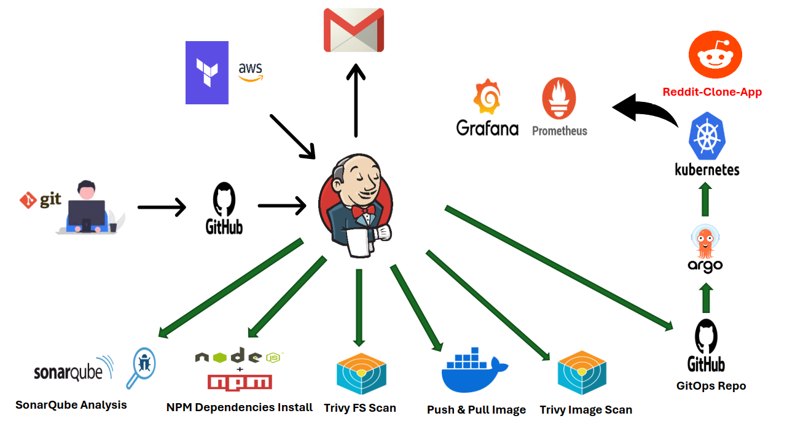

# CI/CD Pipeline Using Terraform, Jenkins, Kubernetes, and ArgoCD

## Description
This project sets up a complete CI/CD pipeline for deploying a Node.js application on Kubernetes. It includes:

- **Build** : Installing npm dependencies and building the application.
- **Code Analysis** : Using SonarQube to assess code quality and Trivy for filesystem vulnerability scanning.
- **Image Build and Push**: Building the Docker image and pushing it to Docker Hub.
- **Security Scan** : Scanning the Docker image on Docker Hub using Trivy.
- **Deployment** : Automating deployment to a Kubernetes (EKS) cluster using ArgoCD and GitOps.

## Architecture

## Prerequisites
- Terraform
- AWS CLI
- Jenkins
- Git
- Docker & Docker Compose
- SonarQube
- Helm
- ArgoCD

## Pipeline Overview:
**1. Infrastructure Creation:**

- Use Terraform to create EC2 instance for Jenkins, Docker, and SonarQube.

**2. Jenkins Configuration:**

- Install and configure Jenkins.
- Set up SonarQube and integrate it with Jenkins.

**3. CI Pipeline:**

- Create a Jenkinsfile to define the CI process.
- Perform the following steps in the CI job:
- Trigger SonarQube for code analysis.
- Install npm dependencies.
- Use Trivy to scan the filesystem for vulnerabilities.
- Build and push the Docker image to Docker Hub.
- Scan the Docker image on Docker Hub using Trivy.

**4. Triggering the CD Job:**

- Once the CI job is completed, trigger the CD job remotely.

**5. CD Pipeline:**

- Push the Docker image to a GitOps repository.
- Use GitOps to trigger ArgoCD.
- ArgoCD deploys the application on the Kubernetes (EKS) cluster.

**6. Cluster Configuration:**

- Create an AWS EKS cluster.
- Install Prometheus and Grafana using Helm for monitoring the Kubernetes cluster.

**7. ArgoCD Setup:**

- Install ArgoCD on the EKS cluster.
- Add the AWS EKS cluster to ArgoCD.
- Configure ArgoCD to deploy Pods on the EKS cluster.
- Automate ArgoCD deployment using a GitOps GitHub repository.

**8. Trigger Mechanism:**

- Set up GitHub webhooks to trigger the CI/CD pipeline.
- Verify the entire pipeline workflow.

## 🔧 Technologies Used  

### **1. Terraform**  
Terraform automates the provisioning of cloud infrastructure using declarative configuration files. It ensures infrastructure is consistent, reproducible, and version-controlled. In this project, Terraform is used to create EC2 instance for Jenkins, Docker, and SonarQube.This approach enables seamless infrastructure management and scalability, forming the foundation of the CI/CD pipeline.  

---

### **2. AWS**  
AWS provides scalable, reliable, and secure cloud infrastructure for hosting applications and services. It is used in this pipeline to host EC2 instance for Jenkins, SonarQube, and Docker. Additionally, AWS EKS (Elastic Kubernetes Service) serves as the managed Kubernetes platform to deploy and orchestrate the application. AWS's robust ecosystem ensures high availability, flexibility, and security for the deployment pipeline.  

---

### **3. Jenkins**  
Jenkins orchestrates the automation of build, test, and deployment workflows, acting as the backbone of the CI/CD pipeline. It triggers code quality analysis using SonarQube, installs npm dependencies, performs filesystem and container vulnerability scans using Trivy, builds Docker images, and pushes them to Docker Hub. Jenkins ensures the pipeline runs smoothly with error detection, providing visibility into each stage of the process.  

---

### **4. SonarQube**  
SonarQube is a powerful tool for analyzing code quality and maintaining secure, clean, and maintainable codebases. It scans the application code during the CI stage, identifying bugs, code smells, and security vulnerabilities. Integrating SonarQube into Jenkins ensures continuous code quality checks, helping developers maintain high standards throughout the development lifecycle.  

---

### **5. Trivy**  
Trivy is a comprehensive security scanner for filesystems and container images. It scans the source code for vulnerabilities during the CI process and performs an additional scan of the Docker image after it is built and pushed to Docker Hub. By incorporating Trivy, this pipeline prioritizes security, ensuring the application and its dependencies are free from known vulnerabilities before deployment.  

---

### **6. Docker**  
Docker is used for containerizing the Node.js application, enabling consistent execution across different environments. The pipeline builds a Docker image of the application and pushes it to Docker Hub for storage and distribution. Docker ensures the application is lightweight, portable, and isolated from host dependencies, making it ideal for scalable deployments.  

---

### **7. Kubernetes (AWS EKS)**  
Kubernetes, orchestrated via AWS EKS, automates the deployment, scaling, and management of containerized applications. It provides a highly available and resilient platform for hosting the Node.js application. Kubernetes ensures the application scales dynamically to handle traffic demands while maintaining fault tolerance and resource efficiency.  

---

### **8. ArgoCD**  
ArgoCD implements GitOps to automate application deployments and updates in Kubernetes clusters based on changes in a Git repository. ArgoCD monitors the GitOps repository for updates and automatically deploys the updated Docker image to the EKS cluster. This ensures that deployments are efficient, consistent, and version-controlled, reducing manual intervention and the risk of errors.  

---

### **9. Prometheus**  
Prometheus is a monitoring tool that collects and stores metrics from Kubernetes resources and applications. It is deployed on the EKS cluster to track system health, resource usage, and performance metrics. Prometheus provides a robust foundation for real-time alerts and monitoring, ensuring potential issues are identified and addressed promptly.  

---

### **10. Grafana**  
Grafana is a visualization tool used to create customizable dashboards for monitoring system metrics. It integrates seamlessly with Prometheus to display detailed insights into application and infrastructure performance. With Grafana, the team can analyze resource utilization and system health, making it easier to optimize and troubleshoot the pipeline and deployed services.  

## Step 1: Infrastructure Creation  

The first step in the pipeline is to provision the necessary infrastructure using Terraform. This includes creating an EC2 instance for hosting Jenkins, Docker, and SonarQube, as well as setting up the required security groups, IAM users, and permissions.  

### Files in This Step  
All related files are located in the `Scripts` [ Scripts Folder](./Scripts/) folder:  
- **`main.tf`**: Defines the EC2 instance (type `t3.large`), security groups, and configurations to allow SSH and other required ports.  
- **`provider.tf`**: Specifies the AWS provider configuration, including the region and access credentials.  
- **`install.sh`**: A shell script for post-provisioning setup that installs Java (JDK), Jenkins, Docker, and Trivy, and builds a SonarQube container using Docker.  

### Key Tasks  
1. **Create IAM User and Attach Policies**:  
   - Create a new IAM user in AWS and attach the necessary policies (e.g., `AdministratorAccess`) for managing infrastructure.  
   - Generate an access key and secret key for the IAM user.  

2. **Prepare the Terraform Files**:  
   - Navigate to the folder containing the Terraform scripts (`main.tf`, `provider.tf`, and `install.sh`).  
   - Ensure the `provider.tf` file contains your AWS access key and secret key for authentication.  

3. **Run Terraform Commands**:  
   Open a terminal in the directory where the Terraform files are located and execute the following commands:  
   - **`terraform init`**: Initializes Terraform and downloads the required provider plugins.  
   - **`terraform plan`**: Previews the infrastructure changes that will be made.  
   - **`terraform apply --auto-approve`**: Creates the infrastructure as defined in the Terraform files.  

### Outcome  
- An EC2 instance of type `t3.large` will be created.  
- Security groups will be configured to allow necessary ports (e.g., HTTP, HTTPS, SSH, and SonarQube ports).  
- The `install.sh` script will execute on the instance, setting up Jenkins, Docker, SonarQube, and Trivy.  

With this setup, the infrastructure for the CI/CD pipeline is ready, and the required tools are installed and configured to proceed with the next steps.  

