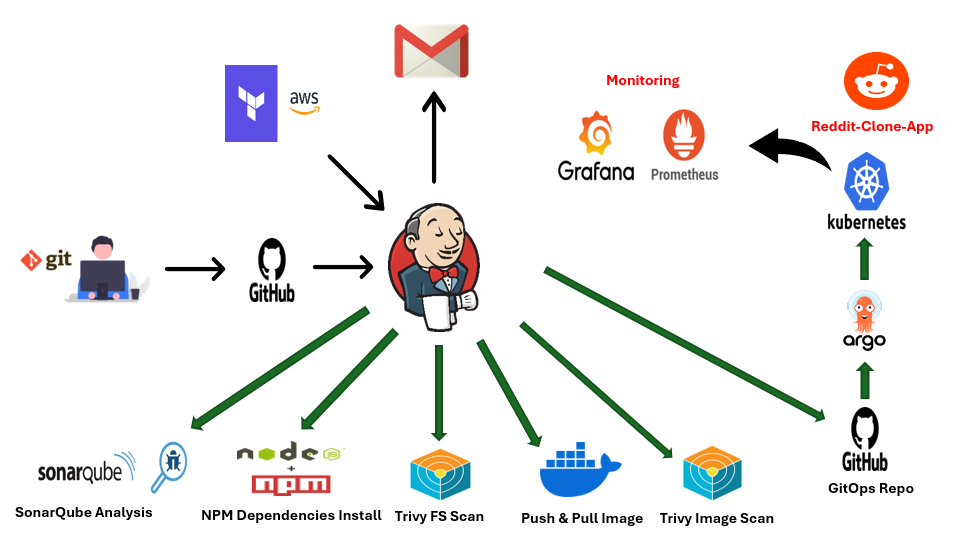

# CI/CD Pipeline Using Terraform, Jenkins, Kubernetes, and ArgoCD

## Description
This project sets up a complete CI/CD pipeline for deploying a Node.js application on Kubernetes. It includes:

- **Build** : Installing npm dependencies and building the application.
- **Code Analysis** : Using SonarQube to assess code quality and Trivy for filesystem vulnerability scanning.
- **Image Build and Push**: Building the Docker image and pushing it to Docker Hub.
- **Security Scan** : Scanning the Docker image on Docker Hub using Trivy.
- **Deployment** : Automating deployment to a Kubernetes (EKS) cluster using ArgoCD and GitOps.

## Architecture


## Prerequisites
- Terraform
- AWS CLI
- Jenkins
- Git
- Docker & Docker Compose
- SonarQube
- Helm
- ArgoCD


## Pipeline Overview:
**1. Infrastructure Creation:**

- Use Terraform to create EC2 instance for Jenkins, Docker, and SonarQube.

**2. Jenkins Configuration:**

- Install and configure Jenkins.
- Set up SonarQube and integrate it with Jenkins.

**3. CI Pipeline:**

- Create a Jenkinsfile to define the CI process.
- Perform the following steps in the CI job:
- Trigger SonarQube for code analysis.
- Install npm dependencies.
- Use Trivy to scan the filesystem for vulnerabilities.
- Build and push the Docker image to Docker Hub.
- Scan the Docker image on Docker Hub using Trivy.

**4. Triggering the CD Job:**

- Once the CI job is completed, trigger the CD job remotely.

**5. CD Pipeline:**

- Push the Docker image to a GitOps repository.
- Use GitOps to trigger ArgoCD.
- ArgoCD deploys the application on the Kubernetes (EKS) cluster.

**6. Cluster Configuration:**

- Create an AWS EKS cluster.
- Install Prometheus and Grafana using Helm for monitoring the Kubernetes cluster.

**7. ArgoCD Setup:**

- Install ArgoCD on the EKS cluster.
- Add the AWS EKS cluster to ArgoCD.
- Configure ArgoCD to deploy Pods on the EKS cluster.
- Automate ArgoCD deployment using a GitOps GitHub repository.

**8. Trigger Mechanism:**

- Set up GitHub webhooks to trigger the CI/CD pipeline.
- Verify the entire pipeline workflow.

## 🔧 Technologies Used  

### **1. Terraform**  
Terraform automates the provisioning of cloud infrastructure using declarative configuration files. It ensures infrastructure is consistent, reproducible, and version-controlled. In this project, Terraform is used to create EC2 instance for Jenkins, Docker, and SonarQube.This approach enables seamless infrastructure management and scalability, forming the foundation of the CI/CD pipeline.  

---

### **2. AWS**  
AWS provides scalable, reliable, and secure cloud infrastructure for hosting applications and services. It is used in this pipeline to host EC2 instance for Jenkins, SonarQube, and Docker. Additionally, AWS EKS (Elastic Kubernetes Service) serves as the managed Kubernetes platform to deploy and orchestrate the application. AWS's robust ecosystem ensures high availability, flexibility, and security for the deployment pipeline.  

---

### **3. Jenkins**  
Jenkins orchestrates the automation of build, test, and deployment workflows, acting as the backbone of the CI/CD pipeline. It triggers code quality analysis using SonarQube, installs npm dependencies, performs filesystem and container vulnerability scans using Trivy, builds Docker images, and pushes them to Docker Hub. Jenkins ensures the pipeline runs smoothly with error detection, providing visibility into each stage of the process.  

---

### **4. SonarQube**  
SonarQube is a powerful tool for analyzing code quality and maintaining secure, clean, and maintainable codebases. It scans the application code during the CI stage, identifying bugs, code smells, and security vulnerabilities. Integrating SonarQube into Jenkins ensures continuous code quality checks, helping developers maintain high standards throughout the development lifecycle.  

---

### **5. Trivy**  
Trivy is a comprehensive security scanner for filesystems and container images. It scans the source code for vulnerabilities during the CI process and performs an additional scan of the Docker image after it is built and pushed to Docker Hub. By incorporating Trivy, this pipeline prioritizes security, ensuring the application and its dependencies are free from known vulnerabilities before deployment.  

---

### **6. Docker**  
Docker is used for containerizing the Node.js application, enabling consistent execution across different environments. The pipeline builds a Docker image of the application and pushes it to Docker Hub for storage and distribution. Docker ensures the application is lightweight, portable, and isolated from host dependencies, making it ideal for scalable deployments.  

---

### **7. Kubernetes (AWS EKS)**  
Kubernetes, orchestrated via AWS EKS, automates the deployment, scaling, and management of containerized applications. It provides a highly available and resilient platform for hosting the Node.js application. Kubernetes ensures the application scales dynamically to handle traffic demands while maintaining fault tolerance and resource efficiency.  

---

### **8. ArgoCD**  
ArgoCD implements GitOps to automate application deployments and updates in Kubernetes clusters based on changes in a Git repository. ArgoCD monitors the GitOps repository for updates and automatically deploys the updated Docker image to the EKS cluster. This ensures that deployments are efficient, consistent, and version-controlled, reducing manual intervention and the risk of errors.  

---

### **9. Prometheus**  
Prometheus is a monitoring tool that collects and stores metrics from Kubernetes resources and applications. It is deployed on the EKS cluster to track system health, resource usage, and performance metrics. Prometheus provides a robust foundation for real-time alerts and monitoring, ensuring potential issues are identified and addressed promptly.  

---

### **10. Grafana**  
Grafana is a visualization tool used to create customizable dashboards for monitoring system metrics. It integrates seamlessly with Prometheus to display detailed insights into application and infrastructure performance. With Grafana, the team can analyze resource utilization and system health, making it easier to optimize and troubleshoot the pipeline and deployed services.  

# Step 1: Infrastructure Creation  

The first step in the pipeline is to provision the necessary infrastructure using Terraform. This includes creating an EC2 instance for hosting Jenkins, Docker, and SonarQube, as well as setting up the required security groups, IAM users, and permissions.  

### Files in This Step  
All related files are located in the [ Scripts Folder](./Scripts/):  
- **`main.tf`**: Defines the EC2 instance (type `t3.large`), security groups, and configurations to allow SSH and other required ports.  
- **`provider.tf`**: Specifies the AWS provider configuration, including the region.
- **`install.sh`**: A shell script for post-provisioning setup that installs Java (JDK), Jenkins, Docker, and Trivy, and builds a SonarQube container using Docker. 

### Key Tasks  
1. **Create IAM User and Attach Policies**:  
   - Create a new IAM user in AWS and attach the necessary policies (e.g., `AdministratorAccess`) for managing infrastructure.  
   - Generate an access key and secret key for the IAM user.  

2. **Configure AWS CLI for Authentication**:

   - Run the command aws configure in your terminal.
   - Enter the access key, secret key.

3. **Prepare the Terraform Files**:  
   - Navigate to the folder containing the Terraform scripts (`main.tf`, `provider.tf`, and `install.sh`).

4. **Run Terraform Commands**:  
   Open a terminal in the directory where the Terraform files are located and execute the following commands:  
   - **`terraform init`**: Initializes Terraform and downloads the required provider plugins.  
   - **`terraform plan`**: Previews the infrastructure changes that will be made.  
   - **`terraform apply --auto-approve`**: Creates the infrastructure as defined in the Terraform files.  

### Outcome  
- An EC2 instance of type `t3.large` will be created.  
- Security groups will be configured to allow necessary ports (e.g., HTTP, HTTPS, SSH, and SonarQube ports).  
- The `install.sh` script will execute on the instance, setting up Jenkins, Docker, SonarQube, and Trivy.  

With this setup, the infrastructure for the CI/CD pipeline is ready, and the required tools are installed and configured to proceed with the next steps.  

### Verification
- After Terraform has successfully applied the infrastructure, verify that the necessary services and tools are installed and running by connecting to the EC2 instance via SSH and running the following commands:

***1. Check Jenkins Status:***

```bash
   systemctl status jenkins 
```
- Ensure Jenkins is active and running.
  
***2. Check Docker Version:***

```bash
   docker --version  
```
- This confirms Docker is installed and provides the installed version
  
***3. Check Trivy Version:***

```bash
   trivy --version
```
- Verifies that Trivy is installed correctly and displays its version.
  
***4. List Docker Containers:***

```bash
   docker ps -a
```
- This lists all running and stopped containers to confirm that the SonarQube container is set up.

# Step 2: Jenkins Setup for CI/CD Pipeline

### 1. Install Necessary Plugins
To configure Jenkins for the CI/CD pipeline, first, install the necessary plugins. These plugins will be required for integrating with NodeJS, JDK, SonarQube, and Docker.

### 2. Install Tools in Jenkins

After installing the required plugins, the next step is to install the tools: `NodeJS 16`, `JDK 17`, `SonarQube Scanner` and `Docker`.

### 3. Configure SonarQube and Jenkins

Next, configure SonarQube and connect it to Jenkins:

 - ***Add SonarQube in Jenkins System*** 
      - Go to **Manage Jenkins** → **Configure System**.
      - Under **SonarQube Servers**, add the SonarQube server by providing the server URL (e.g., `http://<sonarqube-server-url>`).
      - In the **Authentication Token** field, add the SonarQube authentication token you generated in SonarQube.
        
- ***Add Quality Gate***  
      - In the SonarQube configuration within Jenkins, ensure the **Quality Gate** is added. 
      - This ensures the build quality is checked during each build.

 - ***Add Token in Jenkins Credentials*** 
      - Go to **Manage Jenkins** → **Manage Credentials** → (select the scope) → **Add Credentials**.
      - Select **Secret text** and enter your SonarQube authentication token.

- ***Configure GitHub Token***  
      - Similarly, add your GitHub personal access token in the Jenkins credentials: 
         - **Kind**: Secret text
         - **Secret**: GitHub personal access token

### 4. Link GitHub Repository to Jenkins

- Go to **Manage Jenkins** → **Configure System**.
- In the **GitHub Servers** section, click **Add GitHub Server**.
- Enter your GitHub credentials (GitHub token added in Jenkins credentials).

### 5. Add Docker Hub Token

To integrate Docker Hub with Jenkins, follow these steps:

   - Generate Docker Hub Token.
   - Go to **Manage Jenkins** → **Manage Credentials** → (select the scope) → **Add Credentials**.
   - Choose **Kind**: **Secret text**.
   - Enter the **Secret**: your Docker Hub access token.
   - Go to **Manage Jenkins** → **Configure System**.
   - Scroll to the **Docker** section.
   - Add Docker Hub credentials using the token created earlier.
   - Set up your Docker Hub login information using your username and the token.

With these configurations in place, you can now set up your Jenkins job to trigger builds and analyze your code using SonarQube!

# Step 3: Create the Pipeline Script ([Jenkinsfile](./src/Jenkinsfile))

Below is the `Jenkinsfile` defining the CI pipeline. Each stage is explained below.

### Clean Workspace
```groovy
   stage('Clean Workspace') {
      steps {
         cleanWs()
      }
   } 
```
- Cleans the Jenkins workspace to ensure no leftover files from previous builds affect the current build.
### Checkout from Git
```groovy
   stage('Checkout from Git') {
      steps {
         git branch: 'main', url: 'https://github.com/AbdessamadKhaoula/nodejs_application.git'
      }
   }
```
- Pulls the source code from the GitHub repository, ensuring the pipeline uses the latest code.
### SonarQube Analysis
```groovy
stage("SonarQube Analysis") {
    steps {
        withSonarQubeEnv('SonarQube-Server') {
            sh '''$SCANNER_HOME/bin/sonar-scanner -Dsonar.projectName=node-js-app-CI \
            -Dsonar.projectKey=node-js-app-CI'''
        }
    }
}
```
- Runs static code analysis using SonarQube to identify code smells, vulnerabilities, and maintainability issues.
### Quality Gate
```groovy
stage("Quality Gate") {
    steps {
        script {
            waitForQualityGate abortPipeline: false, credentialsId: 'SonarQube-token'
        }
    }
}
```
- Ensures the code meets the quality thresholds defined in SonarQube before proceeding to further stages.
### Install Dependencies
```groovy
stage('Install Dependencies') {
    steps {
        sh "npm install"
    }
}
```
- Installs the required dependencies listed in the package.json file for the Node.js application.
### Trivy FS Scan
```groovy
stage('Trivy FS Scan') {
    steps {
        sh """
        export TRIVY_DB_REPO=ghcr.io/aquasecurity/trivy-db
        trivy fs . > trivyfs.txt """
    }
}
```
- Scans the file system for vulnerabilities using Trivy and outputs the report to trivyfs.txt.
### Build & Push Docker Image
```groovy
stage("Build & Push Docker Image") {
    steps {
        script {
            docker.withRegistry('',DOCKER_PASS) {
                docker_image = docker.build "${IMAGE_NAME}"
            }
            docker.withRegistry('',DOCKER_PASS) {
                docker_image.push("${IMAGE_TAG}")
                docker_image.push('latest')
            }
        }
    }
}
```
- Builds a Docker image for the application and pushes it to Docker Hub with two tags:
1. ${IMAGE_TAG}: Versioned tag.
2. latest: Latest tag.
### Trivy Image Scan
```groovy
stage("Trivy Image Scan") {
    steps {
        script {
            sh ('docker run -v /var/run/docker.sock:/var/run/docker.sock aquasec/trivy image khaoulaabdessamad/nodejs-app:latest --no-progress --scanners vuln  --exit-code 0 --severity HIGH,CRITICAL --format table > trivyimage.txt')
        }
    }
}
```
- Scans the Docker image for vulnerabilities using Trivy and outputs the report to trivyimage.txt.
### Cleanup Artifacts
```groovy
stage ('Cleanup Artifacts') {
    steps {
        script {
            sh "docker rmi ${IMAGE_NAME}:${IMAGE_TAG}"
            sh "docker rmi ${IMAGE_NAME}:latest"
        }
    }
}
```
- Removes the locally built Docker images to free up disk space on the Jenkins agent.
### Trigger CD Pipeline
```groovy
stage("Trigger CD Pipeline") {
    steps {
        script {
            sh "curl -v -k --user clouduser:${JENKINS_API_TOKEN} -X POST -H 'cache-control: no-cache' -H 'content-type: application/x-www-form-urlencoded' --data 'IMAGE_TAG=${IMAGE_TAG}' 'ec2-16-16-199-172.eu-north-1.compute.amazonaws.com:8080/job/NodeJs-app-CD/buildWithParameters?token=gitops-token'"
        }
    }
}
```
- Triggers the CD pipeline to deploy the application using the newly built Docker image.
### Post Actions: Email Notification
```groovy
post {
    always {
        emailext attachLog: true,
            subject: "'${currentBuild.result}'",
            body: "Project: ${env.JOB_NAME}<br/>" +
                  "Build Number: ${env.BUILD_NUMBER}<br/>" +
                  "URL: ${env.BUILD_URL}<br/>",
            to: 'khaoulabdessamad2002@gmail.com',
            attachmentsPattern: 'trivyfs.txt,trivyimage.txt'
    }
}
```
- Sends an email notification with the build result, log, and scan reports attached.
# Step 4: Create CI Job in Jenkins
1. Open Jenkins, go to New Item, and select Pipeline.

2. Name the job (e.g., NodeJS-app-CI) and click OK.

3. In the Pipeline section:

- Choose Pipeline script from SCM.
- Set SCM to Git.
- Add the Git repository URL: https://github.com/.....
- Specify the branch (main) and the script path (Jenkinsfile).
- Save and build the pipeline to execute the CI process.

# Step 5: Setup Email Configuration Alert
This step configures Jenkins to send email alerts for build notifications, ensuring that the team is informed about the success or failure of builds.

### Tasks
**1. Configure Jenkins Email Settings:**

- Go to Manage Jenkins > Configure System.
- Scroll down to the E-mail Notification section.
- Provide the following details:
   - SMTP Server: Specify your email provider's SMTP server (e.g., smtp.gmail.com for Gmail).
   - Default User E-mail Suffix: Set the email domain (e.g., @example.com).

**2. Set Up Extended Email Notification :**

- If you want advanced email configurations, scroll to the Extended E-mail Notification section and configure:
   - SMTP Server: Same as above.
   - SMTP Port: Typically 465 (for SSL) or 587 (for TLS).
   - Authentication: Enable and provide your email username and password.
   - Use SSL or Use TLS: Check the appropriate box based on your SMTP server settings.

**3. Test Email Configuration:**

- In the E-mail Notification or Extended E-mail Notification section, click Test configuration by sending test e-mail.
- Enter a recipient email address and confirm that the test email is received.

**4. Configure Email Alerts in Jenkins Jobs:**

- Open the job for which you want to enable email notifications.
- Go to the Post-build Actions section and select E-mail Notification or Editable Email Notification.
- Provide recipient email addresses and customize the email content (optional).

# Step 6: Create AWS EKS Cluster

This step involves setting up an EKS (Elastic Kubernetes Service) cluster on AWS. Below are the steps to configure and verify the cluster.

---

## 1. Install `kubectl` on Jenkins Server
The `kubectl` command-line tool is used to interact with Kubernetes clusters. To install it:

```bash
sudo apt update
sudo apt install curl
curl -LO https://dl.k8s.io/release/$(curl -L -s https://dl.k8s.io/release/stable.txt)/bin/linux/amd64/kubectl
sudo install -o root -g root -m 0755 kubectl /usr/local/bin/kubectl
kubectl version --client
```
- Updates the package repository.
- Downloads the latest stable release of kubectl.
- Installs the binary to /usr/local/bin with appropriate permissions.
- Verifies the installation using kubectl version --client.

## 2. Install AWS CLI
The AWS Command Line Interface `(CLI)` is required to interact with AWS services, including EKS.

```bash
curl "https://awscli.amazonaws.com/awscli-exe-linux-x86_64.zip" -o "awscliv2.zip"
sudo apt install unzip
unzip awscliv2.zip
sudo ./aws/install
aws --version
```
- Downloads the AWS CLI installer.
- Installs the unzip utility to extract the downloaded archive.
- Installs AWS CLI version 2 and verifies the installation using aws --version.
## 3. Install eksctl
eksctl is a CLI tool to create and manage EKS clusters.

```bash
curl --silent --location "https://github.com/weaveworks/eksctl/releases/latest/download/eksctl_$(uname -s)_amd64.tar.gz" | tar xz -C /tmp
cd /tmp
sudo mv /tmp/eksctl /bin
eksctl version
```
- Downloads the latest release of eksctl.
- Extracts the binary and moves it to /bin for global accessibility.
- Verifies the installation using eksctl version.
## 4. Assign an IAM Role to the EC2 Instance
Attach an IAM role with sufficient permissions (e.g., AmazonEKSClusterPolicy and AmazonEC2RoleforSSM) to the EC2 instance hosting Jenkins.
This allows the instance to interact with AWS services securely.
## 5. Set Up Kubernetes Cluster Using eksctl
Run the following command to create an EKS cluster:

```bash
eksctl create cluster --name nodeJs-cluster \
--region eu-north-1 \
--node-type t3.small \
--nodes 3
```
- name: Specifies the name of the EKS cluster.
- region: Defines the AWS region where the cluster is created.
- node-type: Specifies the EC2 instance type for worker nodes (e.g., t3.small).
- nodes: Indicates the number of worker nodes in the cluster.
## 6. Verify the Cluster
Once the cluster is created, verify it using kubectl:

```bash
kubectl get nodes
```
- A list of nodes with their status, roles, and other details, indicating that the cluster is active and the worker nodes are ready.

# Step 7: Setup Monitoring for Kubernetes Using Helm, Prometheus, and Grafana Dashboard
This step involves setting up monitoring for your Kubernetes cluster by installing Prometheus and Grafana using Helm. Prometheus will collect metrics, and Grafana will provide visualizations and dashboards.

### Tasks
**1. Install Helm:**

Helm is used to manage Kubernetes applications.

```bash
curl -fsSL -o get_helm.sh https://raw.githubusercontent.com/helm/helm/master/scripts/get-helm-3
chmod 700 get_helm.sh
./get_helm.sh
helm version
```
**2. Add Helm repositories:**

Add the necessary `Helm` repositories for Prometheus and Grafana.

```bash
helm repo add stable https://charts.helm.sh/stable
helm repo add prometheus-community https://prometheus-community.github.io/helm-charts
kubectl create namespace prometheus  # Create namespace for Prometheus
```
**3. Install Prometheus Using Helm:**

Install the Prometheus Helm chart in the prometheus namespace.

```bash
helm install stable prometheus-community/kube-prometheus-stack -n prometheus
kubectl get pods -n prometheus  # Verify Prometheus pods
kubectl get svc -n prometheus   # Verify Prometheus services
```
**4. Expose Prometheus to the External World:**

Update the Prometheus service configuration to make it accessible outside the cluster.

```bash
kubectl edit svc stable-kube-prometheus-sta-prometheus -n prometheus
```
- Change ClusterIP to LoadBalancer.
- Update port and targetPort to 9090.
- Save and close.
```bash
kubectl get svc -n prometheus  # copy dns name of LB and browse with 9090
```
**5. Expose Grafana to the External World:**

Modify the Grafana service configuration to make it externally accessible.

```bash
kubectl edit svc stable-grafana -n prometheus
```
- Change ClusterIP to LoadBalancer.
- Save and close.
```bash
kubectl get svc -n prometheus  # Copy the DNS name and access Grafana
```
- Retrieve Grafana Admin Credentials:
- Get the admin password for Grafana to log in.

```bash
kubectl get secret --namespace prometheus stable-grafana -o jsonpath="{.data.admin-password}" | base64 --decode ; echo
```
- The default username is admin.

***Outcome***
   - Prometheus: Accessible via the LoadBalancer DNS at port 9090. Prometheus collects and visualizes Kubernetes metrics.
   - Grafana: Accessible via its LoadBalancer DNS. Grafana provides advanced dashboards and visualizations for Kubernetes monitoring.

# Step 8: ArgoCD Installation on Kubernetes Cluster and Add EKS Cluster to ArgoCD

ArgoCD is a declarative GitOps continuous delivery tool for Kubernetes. This step guides you through installing ArgoCD on the EKS cluster and adding the cluster to ArgoCD.

---

## 1. Create Namespace for ArgoCD
Create a dedicated namespace for ArgoCD resources:

```bash
kubectl create namespace argocd
```
## 2. Apply YAML Configuration Files for ArgoCD
Install ArgoCD using its official YAML configuration:
```bash
kubectl apply -n argocd -f https://raw.githubusercontent.com/argoproj/argo-cd/stable/manifests/install.yaml
```
- Downloads and applies ArgoCD's deployment manifest to install all required components.
## 3. View Created Pods in the ArgoCD Namespace
Check the status of ArgoCD pods:

```bash
kubectl get pods -n argocd
```
- Verifies that all ArgoCD components are running in the argocd namespace.
Deploy ArgoCD CLI
## 4. Install the ArgoCD CLI to interact with the ArgoCD server:

```bash
sudo curl --silent --location -o /usr/local/bin/argocd https://github.com/argoproj/argo-cd/releases/download/v2.4.7/argocd-linux-amd64
sudo chmod +x /usr/local/bin/argocd
```
- Downloads the CLI binary and makes it executable for global access.
## 5. Expose ArgoCD Server
Change the service type of the ArgoCD server to LoadBalancer for external access:

```bash
kubectl patch svc argocd-server -n argocd -p '{"spec": {"type": "LoadBalancer"}}'
```
- Exposes the ArgoCD server to the internet using a load balancer.
## 6. Wait for LoadBalancer Creation
Check the service status to retrieve the external IP or hostname:

```bash
kubectl get svc -n argocd
```
Explanation:
Takes a few minutes for the load balancer to be fully operational.
## 7. Retrieve and Decode the Admin Password
Get the initial admin password and decode it:
```bash
kubectl get secret argocd-initial-admin-secret -n argocd -o yaml
echo WXVpLUg2LWxoWjRkSHFmSA== | base64 --decode
```
- Extracts the encoded admin password from the ArgoCD secret and decodes it.
- Use the decoded password for initial login.
## 8. Login to ArgoCD via CLI
Log in to ArgoCD using the server's external IP or hostname:

```bash
argocd login <ARGOCD_SERVER_URL> --username admin
```
- Replace <ARGOCD_SERVER_URL> with the external hostname from the kubectl get svc command.
## 9. View Available Clusters in ArgoCD
Check all clusters currently managed by ArgoCD:

```bash
argocd cluster list
```
- Displays clusters connected to ArgoCD.
## 10. Retrieve EKS Cluster Context Details
Get the context information of the EKS cluster:
```bash
kubectl config get-contexts
```
- Shows details like the context name, cluster, and user.
## 11. Add EKS Cluster to ArgoCD
Register the EKS cluster with ArgoCD:
```bash
argocd cluster add <EKS_CLUSTER_CONTEXT> --name nodeJs-eks-cluster
```
- Replace <EKS_CLUSTER_CONTEXT> with the appropriate context name from kubectl config get-contexts.
- Adds the EKS cluster to ArgoCD for application management and GitOps workflows.
## 12. Verify Clusters in ArgoCD
Check the list of clusters connected to ArgoCD:
```bash
argocd cluster list
```
By following these steps, ArgoCD will be installed on your Kubernetes cluster, and your EKS cluster will be integrated for seamless application deployment and management.

---

# Step 9: Configure ArgoCD for Deployment on EKS Cluster with GitOps

This step involves configuring ArgoCD to deploy a pod on the EKS cluster and automating the deployment process using a GitOps repository containing the following configuration files:

### 1. Files in the GitOps Repository [ GitOps Folder](./GitOps-files/): 
- **deployment.yaml**

This file defines the Deployment configuration for the application, specifying how the application should be deployed in the Kubernetes cluster. Key components include:

   - Replicas: Defines the number of pod replicas to ensure high availability.
   - Selectors and Labels: Ensure pods are associated with the correct application.
   - Container Definition: Specifies the Docker image to use (khaoulaabdessamad/nodejs-app:$IMAGE_TAG) and resource limits for the application.
   - Port Mapping: Maps the container’s port to the service layer.
- **service.yaml**

This file defines the Service configuration to expose the application to the external network. Key components include:

   - Type: A LoadBalancer type service, which automatically provisions an external IP to access the application.
   - Ports: Specifies the application port (3000) to allow traffic.
   - Selectors: Matches the application pods created by the deployment.yaml file.
- **Jenkinsfile**

This is the pipeline script for Jenkins, automating the process of updating the deployment. Key stages include:

   - Workspace Cleanup: Ensures a clean environment for the pipeline execution.
   - SCM Checkout: Fetches the GitOps repository containing the deployment configuration.
   - Deployment Tag Update: Modifies the deployment.yaml file with the new application image tag.
   - Push to GitHub: Pushes the updated deployment.yaml back to the repository, triggering ArgoCD to redeploy the application automatically.
### 2. Configure ArgoCD for GitOps
Add the GitOps Repository to ArgoCD:
- Log in to the ArgoCD dashboard.

- Navigate to Applications > Create Application.

- Fill in the following details:

   - Application Name: reddit-clone-app
   - Project: default
   - Sync Policy: Automatic
   - Repository URL: https://github.com/AbdessamadKhaoula/gitOps-pipline
   - Path: ./
   - Cluster URL: <EKS Cluster Context>
   - Namespace: default
-Click Create.

### 3. Validate Deployment
- Navigate to the ArgoCD dashboard.
- Select the reddit-clone-app application.
- Verify that the deployment.yaml and service.yaml files are applied successfully, and the pod is running on the EKS cluster.
- Run the following command to verify:
```bash
kubectl get pods -n default
kubectl get svc -n default
```
- Expected Output:
   - Pod with the name reddit-clone-deployment is running.
   - A service with type LoadBalancer is created with an external IP.
# Step 10: Automate Deployment with Jenkins (Create Continuous Deployment Job)
In this step, Jenkins is configured to automate the deployment process for your application, ensuring that the latest changes are seamlessly integrated and deployed to the Kubernetes cluster. The process leverages ArgoCD for GitOps-based continuous deployment.

**Key Objectives:**

- Pull the latest changes from the GitOps repository.
- Update the deployment.yaml file with the new Docker image tag.
- Commit and push the updated file back to the repository.
- Trigger ArgoCD to detect changes and redeploy the updated application.

**Detailed Instructions:**

Create a New Jenkins Pipeline Job:

- Open Jenkins and navigate to New Item.
- Select Pipeline as the job type.
- Enter a name for the job (e.g., NodeJS-app-CD) and click OK.
- Configure the Pipeline Job:
- In the Pipeline section, set the following:
   - Definition: Select Pipeline script from SCM.
   - SCM: Choose Git.
   - Repository URL: Add the Git repository URL (e.g., https://github.com/...).
   - Branch: Specify the branch to track (e.g., main).
   - Script Path: Provide the path to the Jenkins pipeline script (e.g., Jenkinsfile).
   - Define the IMAGE_TAG Parameter: Add a parameter to dynamically specify the Docker image tag during the deployment process.
This allows the pipeline to update the deployment.yaml file with the correct image version.
Trigger ArgoCD Redeployment: ArgoCD monitors the repository for changes. Once it detects the updated deployment.yaml file, it automatically applies the changes and redeploys the application to the Kubernetes cluster.

**Save and test the Pipeline**
 
The final setup ensures a fully automated CI/CD pipeline that seamlessly integrates code changes from the `reddit-clone-app` repository into deployment. This includes triggering the CI job when a code push is detected, updating the `IMAGE_TAG` dynamically, and triggering the CD job remotely to deploy the latest version of the application.

### Process Description:
**1. Trigger CI Job on Code Push:**

- Configure a webhook in the reddit-clone-app repository to notify Jenkins of changes.
- When a developer pushes code to the repository, the CI job is triggered automatically.
- The CI job performs the following tasks:*
   - Clones the repository.
   - Builds the application and creates a new Docker image.
   - Tags the image with a unique version (IMAGE_TAG as v1.0.x).
   - Pushes the new Docker image to the container registry.

**2. Update IMAGE_TAG in GitOps Repository:**

- After completing the CI job, Jenkins updates the deployment.yaml file in the GitOps repository to reference the new Docker image tag.
- The file update is committed and pushed to the GitOps repository.

**3. Trigger the CD Job Remotely:**

- The CI job triggers the CD job remotely using Jenkins a webhook.
- The CD job:
   - Pulls the updated deployment.yaml file from the GitOps repository.
   - Ensures the IMAGE_TAG reflects the latest Docker image version.
   - Deploys the updated configuration to the Kubernetes cluster using ArgoCD.

**4. Monitor ArgoCD Deployment:**

- ArgoCD continuously monitors the GitOps repository for changes.
- When the updated `deployment.yaml` is detected, ArgoCD applies the changes to the Kubernetes cluster.
### Outcome:
- Code pushes to the reddit-clone-app repository automatically trigger the CI job.
- The IMAGE_TAG is updated dynamically and deployed to Kubernetes through the CD job.
- The pipeline ensures a fully automated and reliable deployment process with minimal manual intervention.
## Video Demonstrating the CI/CD Pipeline
Here’s a video demonstrating the complete CI/CD pipeline.
[](https://drive.google.com/file/d/13H-ZOjmFkjh15poHVeL6_Oq-PJPK4TFS/view)
